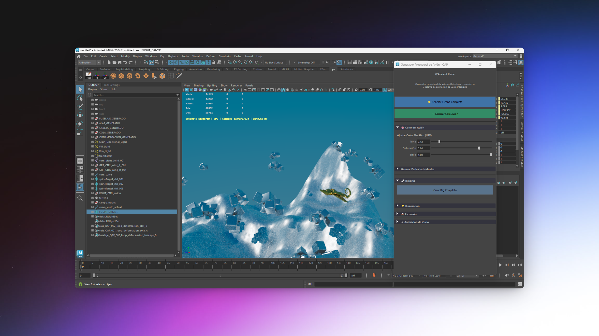
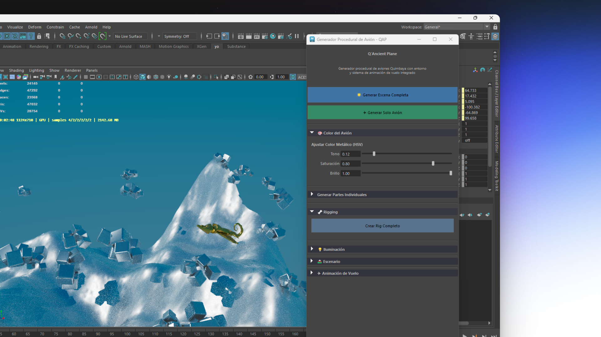

# Q'Ancient Plane

[](https://www.autodesk.com/products/maya/overview)
[](https://www.python.org/)
[](https://docs.astral.sh/uv/)


**Q'Ancient Plane** es un toolkit completo para Autodesk Maya que permite generar de forma procedural, riggear, texturizar y animar escenas inspiradas en los famosos avioncitos precolombinos de la cultura Quimbaya (los “avioncitos de oro”). Todo el flujo se controla desde una interfaz intuitiva dentro de Maya, logrando escenas únicas con tan solo unos clics.

  

  

## ✨ Características principales

- **Generación procedural del avión**: Importa y ensambla piezas (fuselaje, alas, cabeza, etc.) con deformaciones procedurales para resultados únicos en cada generación.
- **Rigging automático**: Crea un rig Spline IK completo con controles listos para animación.
- **Entorno procedural**: Terrenos montañosos extensos y nubes volumétricas estilizadas.
- **Materiales avanzados**: Shaders metálicos procedurales (oro, plata, cobre…) con Arnold `aiStandardSurface`.
- **Iluminación profesional**: Sistema de 3 puntos + SkyDome Arnold totalmente configurable (día, atardecer, noche, tormenta…).
- **Sistema de animación de vuelo**: Trayectorias suaves, circulares o acrobáticas con animación automática del avión.
- **Interfaz todo-en-uno**: Control total desde una única ventana dentro de Maya.

## 🎮 Interfaz principal

- **`🌟 Generar Escena Completa`**: ¡Un solo clic! Crea avión + rig + terreno + nubes + materiales + iluminación.
- **`✈️ Generar Solo Avión`**: Solo el avión con materiales (ideal para pruebas rápidas).
- **Controles avanzados**: Cada sección (Color, Rigging, Iluminación, Escenario, Animación) es expandible para ajustes finos.

## Estructura del proyecto

```
Q-Ancient-Plane/
├── UI/               → Interfaz gráfica principal (qancient_plane.py)
├── Utils/            → Lógica central: importación, deformaciones, escena completa
├── PlaneRig/         → Rigging del cuerpo y alas
├── SplineRig/        → Rig flexible basado en spline
├── Environment/      → Terreno y nubes procedurales
├── Materials/        → Shaders Arnold metálicos y ambientales
├── Lights/           → Iluminación 3 puntos + SkyDome con presets
├── Animation/        → Curvas de vuelo y controlador de animación
├── axiomas/          → plane_config.json (parámetros procedurales)
└── send2maya.py      → Envío de código desde VSCode a Maya
```

## 🛠 Configuración para desarrolladores (Maya + VSCode)

Este repositorio está preparado para un flujo profesional: escribir y enviar código desde VSCode directamente a una sesión de Maya en ejecución.

### Requisitos
- Python coincidente con la versión de Maya
- Visual Studio Code
- `uv` (instalador rápido de paquetes): `pip install uv`

### Pasos de configuración

1. **Comprueba la versión de Python de Maya**  
   ```python
   import sys; print(sys.version)
   ```

2. **Actualiza la versión de Python del proyecto**  
   Modifica `requires-python` en `pyproject.toml` y el archivo `.python-version`.

3. **Crea el entorno virtual**  
   ```bash
   uv sync
   ```
   Se creará `.venv` con los stubs de Maya para autocompletado.

4. **Configura `userSetup.py` en Maya**  
   Ruta: `C:\Users\<TU_USUARIO>\Documents\maya\<VERSIÓN>\scripts\userSetup.py`

   ```python
   import maya.cmds as cmds
   import sys

   repo_path = r"C:\ruta\a\tu\Q-Ancient-Plane"
   if repo_path not in sys.path:
       sys.path.append(repo_path)

   # Abrir puerto de comandos para VSCode
   if not cmds.commandPort(":4434", query=True):
       cmds.commandPort(name=":4434")
   ```

5. **¡Ejecuta desde VSCode!**  
   Abre cualquier archivo `.py` del proyecto → `Ctrl + Shift + B` → el código se envía y ejecuta en Maya automáticamente.

- Para más detalles acerca del setup del vsCode con maya mira este repositorio 👉 https://github.com/JuanJoII/vscode-environment-for-maya

---

**¡Crea tus propios avioncitos Quimbaya voladores en minutos!** ✈️🗿

¿Te animas a probarlo? ¡Deja una estrella ⭐ si te gusta!